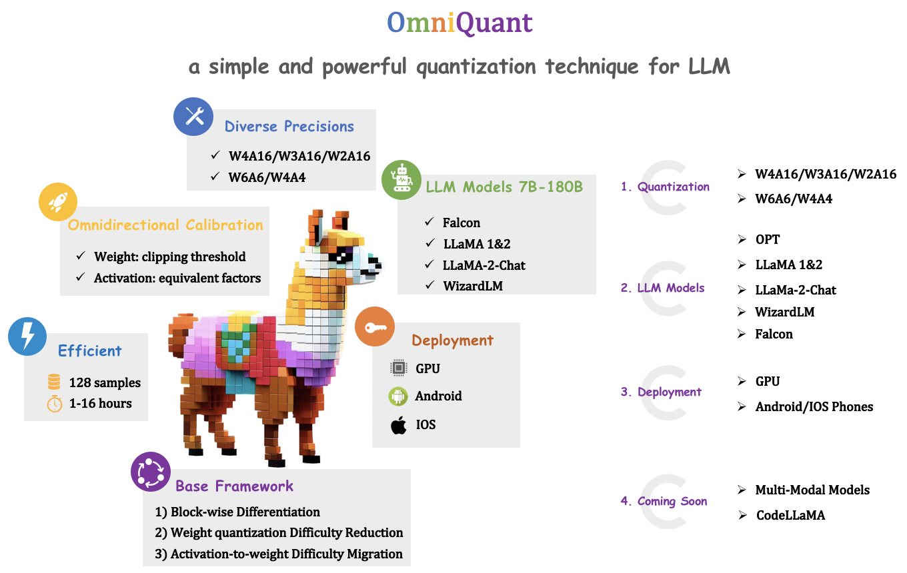
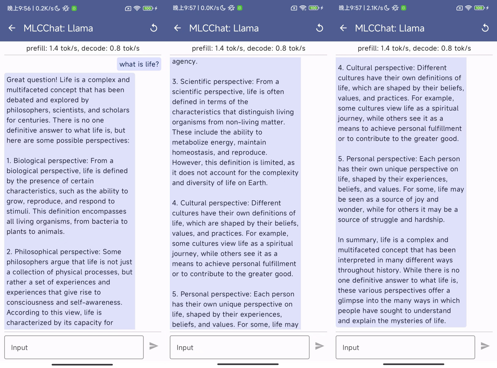
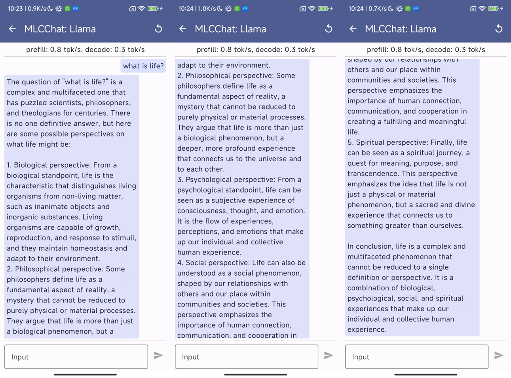
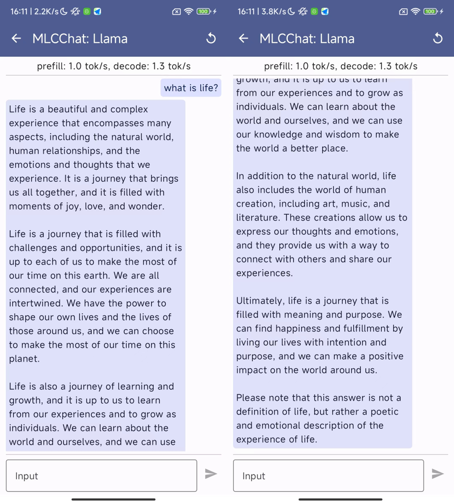
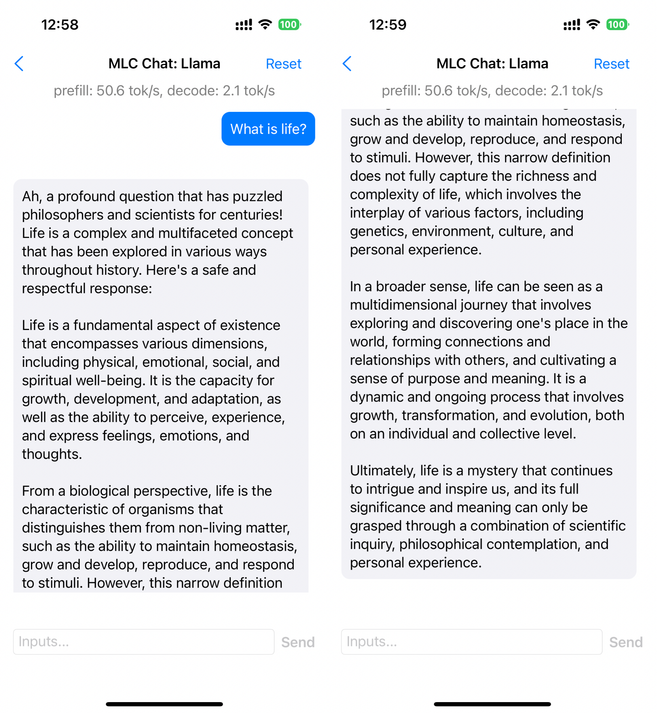
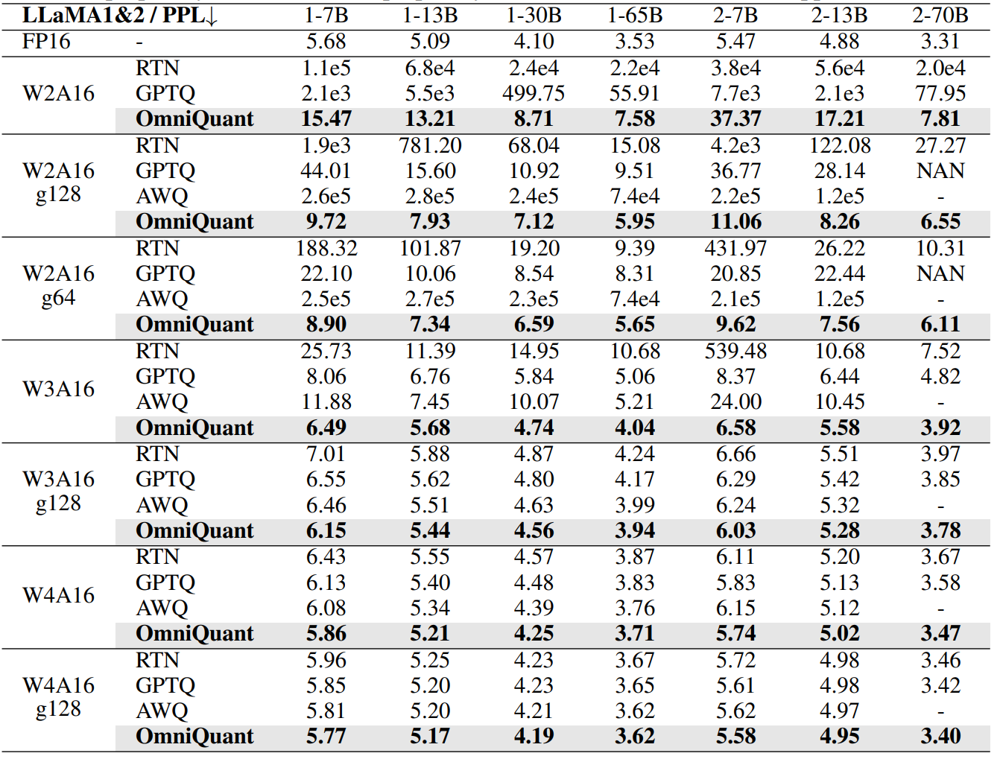
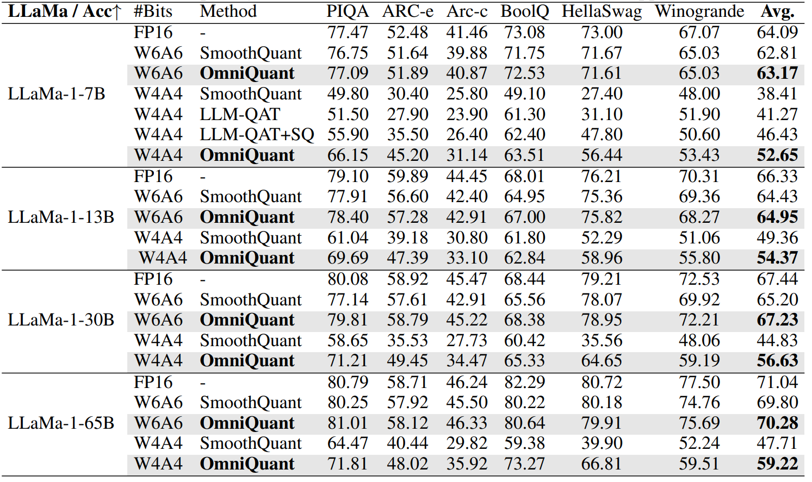
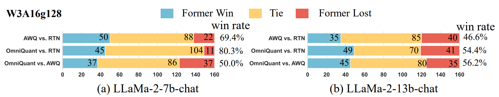
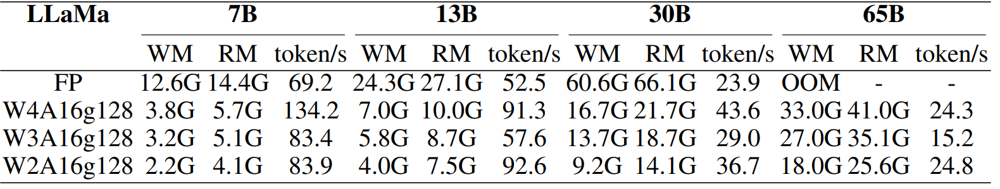

# OmniQuant: Omnidirectionally Calibrated Quantization for Large Language Models




OmniQuant is a simple and powerful quantization technique for LLMs. The current release supports:
- OmniQuant algorithm for accurate weight-only quantization (`W4A16`/`W3A16`/`W2A16`) and weight-activation quantization (`W6A6`, `W4A4`)
- Pre-trained Omniquant model zoo for LLMs (`LLaMA-1&2`, `LLaMA-2-Chat`, `OPT`, `Falcon`; load to generate quantized weights).
- A out-of-the-box case that leverages MLC-LLM to run LLaMa-2-Chat (7B/13B) with W3A16g128 quantization on GPUs and mobile phones.


## Contents
- [Install](#install)
- [Omniquant Model Zoo](#omniquant-model-zoo)
- [Usage](#usage)
- [Inference with MLC-LLM](#runing-quantized-models-with-mlc-llm)
- [Results](#results)
- [Citation](#citation)

## Install
```
conda create -n omniquant python=3.10 -y
conda activate omniquant
git clone https://github.com/anonymous998899/OmniQuant.git
cd OmniQuant
pip install --upgrade pip 
pip install -e .
```

We also leverage the kernel from [AutoGPTQ](https://github.com/PanQiWei/AutoGPTQ) to achieve real quantization. So you should also install the bug-fixed AutoGPTQ as follows:
```
git clone https://github.com/PanQiWei/AutoGPTQ.git
pip install -v .
```


## Usage
**We provide full script to run OmniQuant in `./scripts/`**. We use LLaMa-7B as an example here:
1. Obtain the channel-wise scales and shifts required for initialization:

```
python generate_act_scale_shift.py --model /PATH/TO/LLaMA/llama-7b
```

2. Weight-only quantization
```
# W3A16
CUDA_VISIBLE_DEVICES=0 python main.py \
--model /PATH/TO/LLaMA/llama-7b  \
--epochs 20 --output_dir ./log/llama-7b-w3a16 \
--eval_ppl --wbits 3 --abits 16 --lwc

# W3A16g128
CUDA_VISIBLE_DEVICES=0 python main.py \
--model /PATH/TO/LLaMA/llama-7b  \
--epochs 20 --output_dir ./log/llama-7b-w3a16g128 \
--eval_ppl --wbits 3 --abits 16 --group_size 128 --lwc
```

3. weight-activation quantization
```
# W4A4
CUDA_VISIBLE_DEVICES=0 python main.py \
--model /PATH/TO/LLaMA/llama-7b  \
--epochs 20 --output_dir ./log/llama-7b-w4a4 \
--eval_ppl --wbits 4 --abits 4 --lwc --let \
--tasks piqa,arc_easy,arc_challenge,boolq,hellaswag,winogrande
```

More detailed and optional arguments:
- `--model`: the local model path or huggingface format.
- `--wbits`: weight quantization bits. 
- `--abits`: activation quantization bits.
- `--group_size`: group size of weight quantization. If no set, use per-channel quantization for weight as default.
- `--lwc`: activate the Learnable Weight Clipping (LWC).
- `--let`: activate the Learnable Equivalent Transformation (LET).
- `--lwc_lr`: learning rate of LWC parameters, 1e-2 as default.
- `--let_lr`: learning rate of LET parameters, 5e-3 as default.
- `--epochs`: training epochs. You can set it as 0 to evaluate pre-trained OmniQuant checkpoints.
- `--nsamples`: number of calibration samples, 128 as default.
- `--eval_ppl`: evaluating the perplexity of quantized models.
- `--tasks`: evaluating zero-shot tasks.
- `--resume`: loading pre-trained OmniQuant parameters.
- `--multigpu`: to inference larger network on multiple GPUs
- `--real_quant`: real quantization, which can see memory reduce
- `--save_dir`: saving the quantization model for further exploration.


## Runing Quantized Models with MLC-LLM
we deploy the aforementioned two quantized models into mobile phones through MLC-LLM. You can download the Android app by simply clicking the button below:

[](https://github.com/anonymous998899/OmniQuant/releases/download/v0.0.1/omniquant-mlc-llm.apk)

This app includes three models, `LLaMa-2-7B-Chat-Omniquant-W3A16g128asym`, `LLaMa-2-13B-Chat-Omniquant-W3A16g128asym`, and `LLaMa-2-13B-Chat-Omniquant-W2A16g128asym`. They require at least 4.5G, 7.5G, and 6.0G free RAM, respectively. Note that 2bit quantization has worse performance compared to 3bit quantization as shown in our paper. The inclusion of 2-bit quantization is just an extreme exploration about deploy LLM in mobile phones. Currently, this app is in its demo phase and may experience slower response times, so wait patiently for the generation of response. We have tested this app on Redmi Note 12 Turbo (Snapdragon 7+ Gen 2 and 16G RAM), some examples are provided below:
- LLaMa-2-7B-Chat-Omniquant-W3A16g128asym
<div style="text-align: center;">

</div>

- LLaMa-2-13B-Chat-Omniquant-W3A16g128asym
<div style="text-align: center;">

</div>

- LLaMa-2-13B-Chat-Omniquant-W2A16g128asym
<div style="text-align: center;">

</div>

We also have tested this app on iPhone 14 Pro (A16 Bionic and 6G RAM), some examples are provided below:
- LLaMa-2-7B-Chat-Omniquant-W3A16g128asym
<div style="text-align: center;">

</div>

## Results
- OmniQuant achieve SoTA performance in weight-only quantization

- OmniQuant achieve SoTA performance in weight-activation quantization

- OmniQuant is generalize, also obatins excellent performance in instruction-tuned models with GPT-4 evaluation

- MLC-LLM can obtain really speedup and memory saving for W4A16/W3A16/W2A16 quantization


